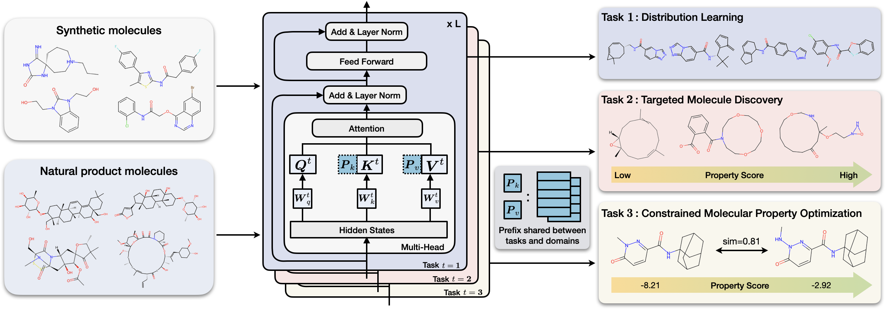

<h1 align="center">  ⚗️ MolGen  </h1>
<h3 align="center"> Domain-Agnostic Molecular Generation with Chemical Feedback </h3>

<p align="center">
  📃 <a href="https://arxiv.org/abs/2301.11259" target="_blank">Paper</a> • 🤗 <a href="https://huggingface.co/zjunlp/MolGen-large" target="_blank">Model</a>  • 🔬 <a href="https://huggingface.co/spaces/zjunlp/MolGen" target="_blank">Space</a> <br>
</p>

[](https://pytorch.org/)

[](https://github.com/zjunlp/MolGen/blob/main/LICENSE)


<div align=center></div>

# 🔔 News 

- **`2024-2` We've released [ChatCell](https://huggingface.co/papers/2402.08303), a new paradigm that leverages natural language to make single-cell analysis more accessible and intuitive. Please visit our [homepage](https://www.zjukg.org/project/ChatCell) and [Github page](https://github.com/zjunlp/ChatCell) for more information.**
- **`2024-1` Our paper [Domain-Agnostic Molecular Generation with Chemical Feedback](https://github.com/zjunlp/MolGen) is accepted by ICLR 2024.**
- **`2024-1` Our paper [Mol-Instructions: A Large-Scale Biomolecular Instruction Dataset for Large Language Models](https://github.com/zjunlp/Mol-Instructions) is accepted by ICLR 2024.**
- **`2023-10` We open-source [MolGen-7b](https://huggingface.co/zjunlp/MolGen-7b), which now supports de novo molecule generation!** 
- **`2023-6` We open-source [KnowLM](https://github.com/zjunlp/KnowLM), a knowledgeable LLM framework with pre-training and instruction fine-tuning code (supports multi-machine multi-GPU setup).**
- **`2023-6` We release [Mol-Instructions](https://github.com/zjunlp/Mol-Instructions), a large-scale biomolecule instruction dataset for large language models.**
- **`2023-5` We propose [Knowledge graph-enhanced molecular contrAstive learning with fuNctional prOmpt (KANO)](https://github.com/HICAI-ZJU/KANO) on `Nature Machine Intelligence`, exploiting fundamental domain knowledge in both pre-training and fine-tuning.**
- **`2023-4` We provide a NLP for science paper-list at [https://github.com/zjunlp/NLP4Science_Papers](https://github.com/zjunlp/NLP4Science_Papers).**
- **`2023-3` We release our pre-trained and fine-tuned model on 🤗 **Hugging Face** at [MolGen-large](https://huggingface.co/zjunlp/MolGen-large) and [MolGen-large-opt](https://huggingface.co/zjunlp/MolGen-large-opt).**
- **`2023-2` We provide a demo on 🤗 **Hugging Face** at [Space](https://huggingface.co/spaces/zjunlp/MolGen).**


# 📕 Requirements

To run the codes, You can configure dependencies by restoring our environment:
```
conda env create -f environment.yaml
```

and then：

```
conda activate my_env
```

# 📚 Resource Download
    

You can download the pre-trained and fine-tuned models via Huggingface: [MolGen-large](https://huggingface.co/zjunlp/MolGen-large) and [MolGen-large-opt](https://huggingface.co/zjunlp/MolGen-large-opt).

You can also download the model using the following link: https://drive.google.com/drive/folders/1Eelk_RX1I26qLa9c4SZq6Tv-AAbDXgrW?usp=sharing

Moreover, the dataset used for downstream tasks can be found [here](https://github.com/zjunlp/MolGen/tree/main/moldata/finetune).

The expected structure of files is:

```
moldata
├── checkpoint 
│   ├── molgen.pkl              # pre-trained model
│   ├── syn_qed_model.pkl       # fine-tuned model for QED optimization on synthetic data
│   ├── syn_plogp_model.pkl     # fine-tuned model for p-logP optimization on synthetic data
│   ├── np_qed_model.pkl        # fine-tuned model for QED optimization on natural product data
│   ├── np_plogp_model.pkl      # fine-tuned model for p-logP optimization on natural product data
├── finetune
│   ├── np_test.csv             # nature product test data
│   ├── np_train.csv            # nature product train data
│   ├── plogp_test.csv          # synthetic test data for plogp optimization
│   ├── qed_test.csv            # synthetic test data for plogp optimization
│   └── zinc250k.csv            # synthetic train data
├── generate                    # generate molecules
├── output                      # molecule candidates
└── vocab_list
    └── zinc.npy                # SELFIES alphabet
``` 

# 🚀 How to run


+ ## Fine-tune

    - First, preprocess the finetuning dataset by generating candidate molecules using our pre-trained model. The preprocessed data will be stored in the folder ``output``.

    ```shell
        cd MolGen
        bash preprocess.sh
    ```

    - Then utilize the self-feedback paradigm. The fine-tuned model will be stored in the folder ``checkpoint``.


    ```shell
        bash finetune.sh
    ```

+ ## Generate

    To generate molecules, run this script. Please specify the ``checkpoint_path`` to determine whether to use the pre-trained model or the fine-tuned model.

    ```shell
    cd MolGen
    bash generate.sh
    ```

#  🥽 Experiments

We conduct experiments on well-known benchmarks to confirm MolGen's optimization capabilities, encompassing penalized logP, QED, and molecular docking properties. For detailed experimental settings and analysis, please refer to our [paper](https://arxiv.org/abs/2301.11259).

+ ## MolGen captures real-word molecular distributions


+ ## MolGen mitigates molecular hallucinations
### Targeted molecule discovery


### Constrained molecular optimization


# Citation

If you use or extend our work, please cite the paper as follows:

```bibtex
@inproceedings{fang2023domain,
  author       = {Yin Fang and
                  Ningyu Zhang and
                  Zhuo Chen and
                  Xiaohui Fan and
                  Huajun Chen},
  title        = {Domain-Agnostic Molecular Generation with Chemical feedback},
  booktitle    = {{ICLR}},
  publisher    = {OpenReview.net},
  year         = {2024},
  url          = {https://openreview.net/pdf?id=9rPyHyjfwP}
}
```


